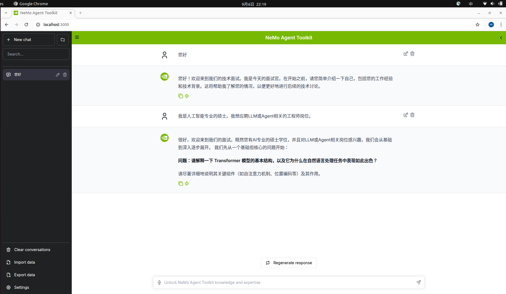

# Interview Master

<div align="center">

✨ 智能面试助手   |   🚀 基于NVIDIA NeMo Agent Toolkit框架


</div>

## 📖 项目简介

- 为了给IT求职者提供一个高仿的面试训练环境，帮助他们练习专业问题对答、发现知识盲点、提升面试技巧，我创建了这个名为“Interview Master“的AI Agent应用项目。 
- 这是一个使用 NVIDIA NeMo Agent Toolkit v1.2 框架构建的智能面试AI助手。
- 该框架的特点是通过顶层的YAML配置文件，便捷地创建Agent Workflow，自动管理多轮对话，并且通过Prompt Engneering就能赋予面试环境的设定。
- 此外本应用项目直接调用nat-ui整合的Node.js Web服务，快速生成浏览器聊天框交互界面。
- 对于底层大模型，选用NVIDIA NIM 在云端部署的 "qwen/qwen3-coder-480b-a35b-instruct" 模型，以提供强大的代码理解和技术评估能力。该Agent能在模拟面试中作出专业性提问，并且对求职者的回答展开针对性追问。
- 对于前沿新颖的话题，该Agent还可通过联网搜索参考实时信息，进而对面试者的回答作出准确评价。
- 本项目可在IT岗位求职应聘、应试备考以及开发者技能自评测试等多个场景发挥助力作用，充分展现了Agentic AI技术的实用价值。


## 📸 项目效果展示




## 安装及使用说明

参考NVIDIA NeMo Agent Toolkit v1.2.0的安装说明。
https://docs.nvidia.com/nemo/agent-toolkit/latest/quick-start/installing.html

主要工作是，把NeMo-Agent-Toolkit的代码项目下载到本地计算机并做好一切初始化工作，配置好NVIDIA API KEY，tavily api key。
把本仓库代码项目中的workflow_configs/interviewer_master_config.yml文件下载到NeMo-Agent-Toolkit项目中。

然后参考启动NeMo Agent Toolkit服务的文档，https://docs.nvidia.com/nemo/agent-toolkit/latest/quick-start/launching-ui.html

在激活环境的一个终端中启动后端服务
```nat serve --config_file=interviewer_master_config.yml```

在激活环境的另一个终端中启动前端服务
```
cd external/nat-ui
npm install
npm run dev
```

用Web浏览器访问http://localhost:3000/

开始模拟面试！
